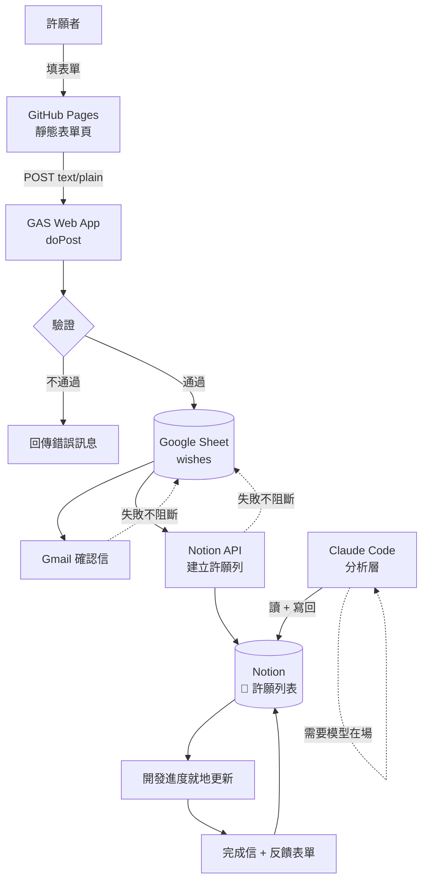

# 架構

## 系統全貌



## 模組職責

| 模組 | 職責 | 不負責 |
|---|---|---|
| `web/` | 表單 UI、前端驗證、蜜罐、冷卻提示 | 任何機密；前端是公開的 |
| `gas/Code.gs` | Web App 進入點、驗證、流程編排 | 商業邏輯細節 |
| `gas/Sheet.gs` | Sheet 讀寫、wishId 產生、補送 | 資料驗證 |
| `gas/Mail.gs` | 三種信：確認、完成、婉拒 | 決定何時寄（由流程決定） |
| `gas/Notion.gs` | Notion API 讀寫與屬性組裝 | 分析內容 |
| `analysis/` | 分析層的規格與指引 | 執行（由 Claude Code 在場時跑） |

## 資料流的兩個關鍵決定

### 1. Sheet 是資料庫，Notion 是展示層

同一筆許願存在兩個地方，各有各的角色：

- **Sheet** — 完整資料**含 email**，是真相來源，也是匯出格式
- **Notion** — **不含 email**，可以公開，給人看進度用

`notionPageId` 存在 Sheet 上，這樣後續更新才找得到要改哪一列（而不是新增重複列）。

### 2. 寫入 Sheet 之後，任何失敗都不回滾

```
驗證 → 寫 Sheet → 寄信 → 寫 Notion
                  ↑
              從這裡開始，失敗只記錄不拋出
```

理由：使用者的心力在按下送出時已經付出了。寄信服務打嗝、Notion API 掛掉，
都不該讓他重填一次表單。失敗會記在 Sheet 的 `notionSyncError` 欄，
用 `retryFailedSyncs()` 補送。

**代價**：會出現「Sheet 有、Notion 沒有」的短暫不一致。這是刻意換來的。

## 技術棧

| 層 | 選擇 | 為什麼 |
|---|---|---|
| 前端 | 原生 HTML/CSS/JS，無框架無建置 | 一個表單不需要框架；GitHub Pages 直接吃 |
| 後端 | Google Apps Script | 零主機成本、內建 Gmail 與 Sheet 授權 |
| 資料庫 | Google Sheet | 天生就是匯出格式；資料量級（一天幾筆）遠低於它的天花板 |
| 展示 | Notion API | 進度看板不用自己做，Notion 的資料庫視圖已經夠好 |
| 分析 | Claude Code（半自動） | 可行性判斷需要專案脈絡，且省下 API 金鑰與費用 |

## 已知限制

- **GmailApp 每天 100 封**（個人帳號）。目前量級遠低於此，爆量時這裡先撞牆
- **GAS 單次執行 6 分鐘**。目前流程約 2–3 秒，離上限很遠
- **Sheet 全表掃描**在 `retryFailedSyncs()` 裡。幾千列都還好，幾萬列要改成索引
- **分析層需要人觸發**——這是選擇不是缺陷，但它代表這不是一個能交給別人自動跑的系統
